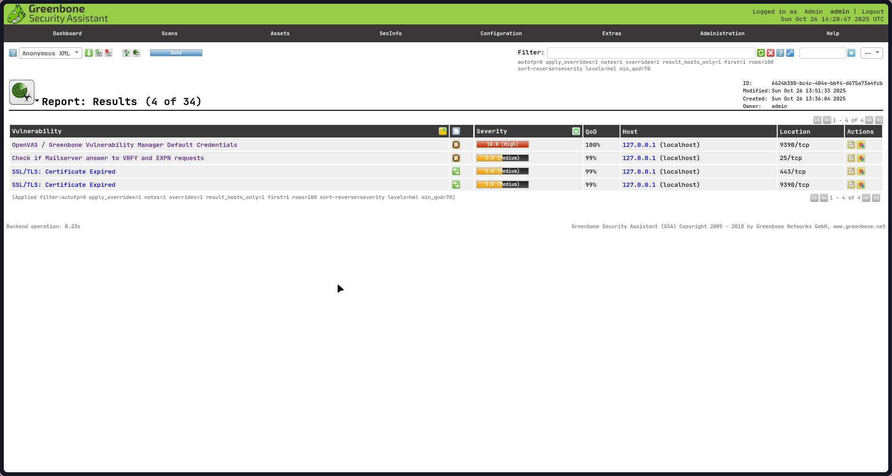

# Day 3: Vulnerability Scanner (OpenVAS) 

## Installation 

OpenVas was executed using docker on the port 443 using the following command: 

```docker run -p 443:443 --name openvas mikesplain/openvas```

Once openvas was fully up and running, the webportal was accessed using the given port, giving us access to OpenVAS


## OpenVAS Scanning 

Under the heading ```Scans >> Tasks```, OpenVAS displayed a dashboard which displayed the statistics of scan results. Using the OpenVAS scan wizard, a simple scan was initiated on the localhost. 


## Results 

The scan took about 30 minutes to finish and it revealed 4 vulnerabilities in the system, one of which was high in severity. The high severity vulnerability simply referred to the OpenVAS default login credentials which I used to sign in.



In the above results, there is a vulnerability with severity level Medium which reveals that my localhost has a mail serving running on port 25. The summary provided by OpenVAS indicates that the issue lies with the Mailserver responding to 'VRFY' or 'EXPN' requests.


A few searches about the issue reveals that responding to such requests might reveal sensitive information regarding the email infrastructure of your particular organization. An attacker might be able to leverage this flaw to add himself to potentially sensitive mailing lists within the organization. None of these possibilities, however apply to my local machine. 

The other 2 vulnerabilities reveal that the SSL/TLS certificate used by OpenVAS is expired. Since OpenVAS was running on port 443 which is commonly the reserved port for https, I believe this was easily flagged. 


An SSL/TLS certificate expiry is a relatively commonplace occurence on the internet but it could be potentially dangerous because the system has no way of verifying the authenticity and the identity of the server. Although the connection established to the server is still encrypted, there is no way to ensure that if the connection is not vulnerable to MITMs (Man in the Middle Attacks). 

## References 

- https://www.criticalpathsecurity.com/securing-mailservers-disabling-the-expn-and-vrfy-commands/
- https://www.tenable.com/plugins/nessus/10249
- https://www.youtube.com/watch?v=sEzN2U4Pqcs
- https://www.youtube.com/watch?v=LGh2SetiKaY


